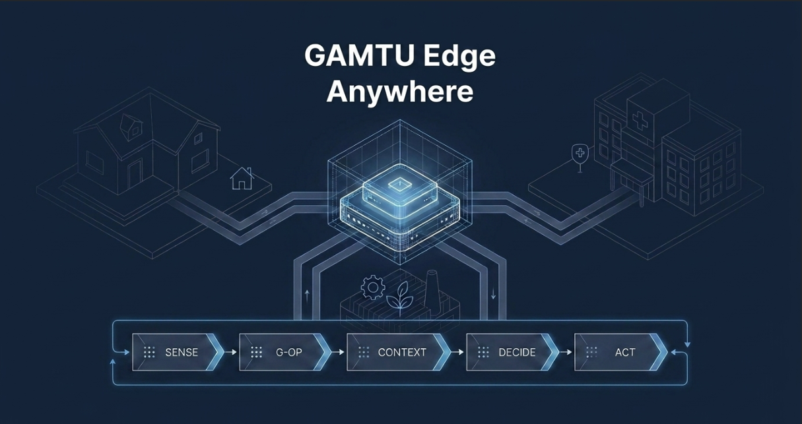
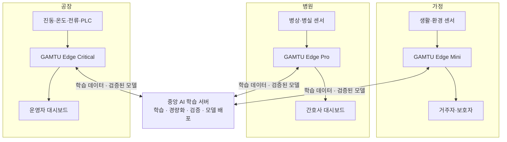

# GAMTU Edge

> Connect anything. Understand locally. Operate continuously.



서로 다른 IoT 장비의 데이터를 현장 맥락으로 해석하고, 인터넷·클라우드·전원 장애 상황에서도 핵심 추론과 제어를 이어가는 범용 AI 엣지 서버 기획 프로젝트입니다.

> [!IMPORTANT]
> 이 저장소는 현재 **제품 기획 및 피치 단계**입니다. 발표에서는 하드웨어·소프트웨어가 완성된 제품을 가정하지만, 저장소에는 실행 가능한 서버·펌웨어·MVP 코드가 포함되어 있지 않습니다.

## 프로젝트 개요

IoT 현장에는 제조사, 통신 규격, 데이터 형식이 서로 다른 장비가 함께 설치됩니다. 이 장비들을 연결하려면 사이트마다 별도의 연동과 SI 개발이 필요하고, 판단을 클라우드에 의존하면 네트워크 또는 전원 장애 시 운영 공백이 생길 수 있습니다.

GAMTU Edge는 각 현장에 독립적으로 설치되어 다음 흐름을 하나의 로컬 파이프라인으로 연결합니다.

```text
SENSE → G-OP → CONTEXT → DECIDE → ACT
```

- **SENSE:** 센서와 장비의 원시 데이터 수집
- **G-OP:** 장치·위치·단위·정상 범위 등 메타데이터를 공통 의미로 변환
- **CONTEXT:** 주변 센서와 현장 상태를 함께 해석
- **DECIDE:** 로컬 AI와 Safety Policy를 이용해 사건과 대응 판단
- **ACT:** 현장 사용자에게 알리거나 연결된 장치를 제어

## 시스템 구조

GAMTU Edge는 하나의 허브가 여러 산업 현장을 원격 연결하는 구조가 아닙니다. **가정·병원·공장 등 각 사이트에 개별 Edge가 배치**되며, 중앙 AI 서버는 학습과 검증된 모델 배포를 담당합니다.



## GAMTU Open Protocol (G-OP)

G-OP는 서로 다른 센서의 원시 데이터를 공통된 현장 의미와 사건으로 변환하기 위한 시맨틱 프로토콜 구상입니다.

```text
DEVICE → PLACE → CONTEXT → EVENT
```

예를 들어 개별 숫자만으로는 의미를 알기 어려운 입력에 장치, 위치, 단위, 상태를 결합해 사건 후보로 변환합니다.

```text
82 + 0 + CLOSED → 욕실 장기 체류 가능성
76.4 + 7.8 + RUN → 모터 베어링 이상 가능성
```

‘모든 데이터를 자동으로 이해한다’는 의미가 아니라, 명시적인 메타데이터와 주변 신호의 관계를 이용해 공통 이벤트 모델로 정규화하는 개념입니다.

## 핵심 가치

| 영역 | 내용 |
|---|---|
| 이기종 연동 | 제조사와 형식이 다른 장비 데이터를 G-OP 기반 공통 의미로 변환 |
| 현장 추론 | 원시 데이터를 모두 클라우드로 보내지 않고 사이트 내부에서 판단 |
| 산업 확장성 | 동일 코어 아키텍처를 가정, 병원, 공장 등 각 현장에 독립 배포 |
| 장애 대응 | 장애 감지, 저전력 비상모드, 로컬 저장, 복구 후 동기화로 핵심 기능 유지 |
| 안전 제어 | Safety Policy와 현장 사용자의 최종 제어권을 우선 |
| 운영 효율 | 반복적인 장치 연동, 맞춤형 SI, 클라우드 전송·운영 비용 절감 지향 |

## 장애 대응 구상

GAMTU Edge는 ‘절대 실패하지 않는 시스템’이 아니라, 장애를 감지하고 필수 기능을 유지한 뒤 안전하게 복구하는 시스템을 지향합니다.

```text
장애 감지
→ 비상모드 전환
→ 핵심 기능 유지
→ 복구 감지
→ 저장 이벤트 동기화
→ 정상모드 복귀
```

내장 배터리, 저전력 비상모드, 상태 체크포인트, 이벤트 로컬 저장, Watchdog, A/B 이미지와 자동 롤백을 기술 후보로 검토하고 있습니다. 발표에서 제시한 **24~48시간 비상 운영**은 아직 검증되지 않은 제품 목표입니다.

## 제품군 및 가격 가설

| 제품 | 대상 환경 | 가격 가설 |
|---|---|---:|
| GAMTU Edge Mini | 가정·소규모 매장 | 69만~99만 원 |
| GAMTU Edge Pro | 병원·요양시설·중소공장 | 149만~249만 원 |
| GAMTU Edge Critical | 대형공장·중요시설 | 490만 원 이상 |

가격 경쟁력은 저가형 보드와의 단순 비교보다, 사이트별 반복 개발과 장기 운영 비용을 얼마나 줄이는지로 검증할 예정입니다.

## 현재 상태와 다음 단계

현재 완료된 범위:

- 안심OS에서 범용 AI 엣지 서버로 제품 방향 피벗
- GAMTU Edge 및 G-OP 핵심 개념 정의
- 가정·병원·공장 적용 시나리오와 시스템 구조 정리
- 제품군·가격 가설 및 장애 대응 전략 수립
- 최종 피치 덱과 발전 과정 문서화

후속 검증이 필요한 범위:

- G-OP 이벤트 스키마와 장치 어댑터 명세
- 단일 사이트용 Edge 프로토타입 및 로컬 추론 파이프라인
- 네트워크·전원 장애 및 복구 시나리오 테스트
- Safety Policy, 권한, 감사 로그와 보안 모델
- 산업별 PoC를 통한 정확도, 지연시간, 운영비 절감 효과 검증

## 프로젝트 산출물

- [최종 GAMTU Edge 피치 덱](./GAMTU_Edge_pitch_slide_deck.pdf)
- [GAMTU Edge 프롬프트 발전 흐름](./WIP/prompt-flow-2.md)
- [안심OS 초기 기획 프롬프트 흐름](./WIP/prompt-flow.md)
- [팀 정보 및 운영 규칙](./docs.md)
- `WIP/` — 이전 피치 덱과 작업 중간 산출물

## 저장소 구조

```text
.
├── README.md
├── docs.md
├── GAMTU_Edge_pitch_slide_deck.pdf
├── docs/
│   └── photo/
│       └── gamtu-edge.png
└── WIP/
    ├── gamtu-product-pitch.pdf
    ├── gamtu-product-pitch_v0.2.pdf
    ├── gamtu-product-pitch-gamma_v0.3.pdf
    ├── prompt-flow.md
    └── prompt-flow-2.md
```

별도의 설치 또는 실행 절차는 아직 없습니다. 이 저장소의 현재 목적은 제품 개념과 발표 산출물을 공유하는 것입니다.

## 팀 감투

| 역할 | 이름 |
|---|---|
| 팀장 | 최예현 |
| 팀원 | 이순필 · 김한별 · 김관영 · 김동혁 |

- 활동 기간: 2026.08.12–2026.08.14
- 팀 구호: **쾌락 없는 책임**

---

**무엇이든 연결하고, 현장에서 이해하며, 끊겨도 계속 작동한다.**
